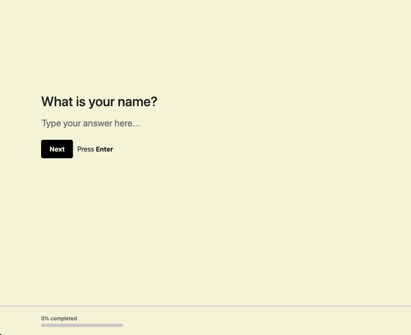

# Formzy
>
[](https://www.npmjs.com/package/formzy) [](https://github.com/airbnb/javascript)

✏️ React library alternative for building TypeForm style forms.

## [See an example](https://sam-ogden.github.io/formzy/).



## Contents
* [Usage](#Usage)
* [Features](#Features)
* [Components](#Components)
  * [FormContainer](#FormContainer)
  * [ShortTextField](#ShortTextField)
  * [NumberField](#NumberField)
  * [DateField](#DateField)
  * [MultipleChoiceField](#MultipleChoiceField)
  * [InformationField](#InformationField)
  * [SubmitField](#SubmitField)
## Usage

```jsx
import React from 'react'
import { FormContainer, ShortTextField, NumberField, DateField, MultipleChoiceFIeld,
         InformationField, SubmitField } from 'formzy'

export default () => (
  <FormContainer 
    showProgress={true} 
    onSubmit={data => console.log(data)}
  >
    <InformationField 
      title="Hello, Welcome To The Fruit Order Form" 
      description="Ready to start?" 
      nextButtonText="Lets Go"
    />
    <ShortTextField 
      title="First off, what's your name?" 
      name="name" 
      minTextLength={2} 
      required 
    />
    <MultipleChoiceFIeld 
      title="Nice to meet you {{_.name}}, what fruit would you like?" 
      name="fruits" 
      options={['Banana', 'Apple', 'Orange', 'Pear']} 
      multiple
    />
    <NumberField 
      title="How many free oranges do you want?" 
      name="noranges"
      min={0}
      defaultValue={5}
    />
    <DateField 
      title="When would you like your {{_.noranges}} oranges?" 
      name="orrangedate" 
      required
    />
    <SubmitField 
      title="Thanks!" 
      description="You will have your fruit shortly." 
      nextBtnText="Send Form" 
    />
  </FormContainer>
)
```
Fields should have unique ```name``` props as values are stored in the FormContainer as {fieldName: value} pairs. And will be passed to the onSubmit callback in this format.

Assuming a value is given for each field in the above example, when the user hits submit, the submit method will receive:  

```data = { name: ..., fruits: [...], noranges: ..., orangedate: { day: ..., month: ..., year: ... } }```  

The last child contained in FormContainer will act as the submit field and when a user clicks the button for that field it will run the onSubmit callback method. 

## Features
* Typeform style scrolling behaviour
* Custom styling
* Reference user inputs in field titles
* Progress bar
* Easy validation
* Ability to build [Custom Fields](#Custom-Fields)

### Reference User Inputs In Titles
Field titles can reference previous user inputs in the titles of other fields. This is achieved by:
* using ```{{_.FIELD_NAME}}``` in the title prop.

## Components
* [FormContainer](#FormContainer)
* [ShortTextField](#ShortTextField)
* [NumberField](#NumberField)
* [DateField](#DateField)
* [MultipleChoiceField](#MultipleChoiceField)
* [InformationField](#InformationField)


### FormContainer
Container component for handling form state and transitions between form fields. 

**All Fields in the form must be children of the FormContainer component.**
```jsx
FormContainer.propTypes = {
  /**
   * onSubmit: Function to call upon submission. Recieve form data object as arg.
   * Returns: object of errors, or true if there are none.
   * returned errors object should look like: { fieldName: [ 'err' ], field2: [ 'err' ], ... }
   */
  onSubmit: func.isRequired,
  children: oneOfType( [ arrayOf( // Array of fields (form body)
    instanceOf( Object ),
  ), instanceOf( Object ) ] ).isRequired,
  showProgress: bool, // Whether to show progress bar
  scrollDuration: number, // Scroll animation time
  edgeOffset: number, // Add offset to scroll to prevent field from being hidden by a header
}

FormContainer.defaultProps = {
  showProgress: true,
  scrollDuration: 777,
  edgeOffset: 0,
}
```
## Field Components
Field components are always children of the FormContainer component

All fields have a common set of props as shown below, as well as additional props relevant only to themselves 
```jsx
commonPropTypes = {
  title: string,
  description: string,
  name: string, // Input name - values entered by user are stored as [name]: value. Must be unique.
  defaultValue: any,
  required: bool,
  placeholder: string,
  nextBtnText: string,
}
const commonDefaultProps = {
  title: '',
  description: '',
  name: '',
  defaultValue: null,
  required: false,
  placeholder: 'Type your answer here...',
  nextBtnText: 'Next',
}
```
### ShortTextField
```jsx
ShortTextField.propTypes = {
  ...commonPropTypes,
  maxLength: number,
}

ShortTextField.defaultProps = {
  ...commonDefaultProps,
  maxLength: 524288,
}
```
### NumberField
```jsx
NumberField.propTypes = {
  ...commonPropTypes,
  min: number,
  max: number,
}

NumberField.defaultProps = {
  ...commonDefaultProps,
  min: Number.MIN_VALUE,
  max: Number.MAX_VALUE,
}
```
### DateField
```jsx
DateField.propTypes = {
  ...commonPropTypes,
  includeTime: bool, // Whether to display time input field
}

DateField.defaultProps = {
  ...commonDefaultProps,
  includeTime: false,
}
```
### MultipleChoiceField
```jsx
MultipleChoiceField.propTypes = {
  ...commonPropTypes,
  options: arrayOf( string ).isRequired, // The possible options to pick from
  multiple: bool, // Whether the user can select multiple options
}

MultipleChoiceField.defaultProps = {
  ...commonDefaultProps,
  multiple: false,
}
```

### InformationField
This field is used to display information to the user, e.g. a welcome screen. 

### SubmitField
This component should be used as the last child within FormContainer as the last child component within FormContainer is always assumed to be the submit field and will run the submit call back when the next button is pressed.


## Custom Fields
Fields can be created using the withValidationAndTransition higher order component and the ```<Field />``` component which are both exported by formzy. 

### The ```<Field />``` Component
This is the default way to display the field components, it displays the title, description, validation errors and the next button. See ```src/components/fields/NumberField.js``` for example usage in the render method.
```jsx
Field.propTypes = {
  children: instanceOf( Object ), // The input element
  title: string.isRequired, // The title of the field
  description: string, // Description for additional instructions
  next: func, // The function to call to scroll to the next field
  nextBtnText: string, // Text to display in the next button
  err: arrayOf( string ), // Any errors in the input given by a user
  required: bool,
  containerRef: shape( { current: instanceOf( Element ) } ), // Reference for container to scroll to
}

Field.defaultProps = {
  description: '',
  next: null,
  nextBtnText: 'Next',
  err: [],
  required: false,
  containerRef: null,
  children: null,
}
```
You can create your own Field component for use with your own fields. (Future feature: ability to pass in custom Field component to FormContainer so you can reuse all the premade fields with your own UI structure for the title/description/next buttons/errors).

### The withValidationAndTransition HOC
This component adds shared functionality to all field components. 
* It provides validation checking and modifications
* Registering validation errors with the parent component (FormContainer)
* Passing the input value up to the parent component for centralised management of the form state. 
* Handles when a field can transition to the next section after a user clicks the next button or hits enter. 

### Validation For Custom Fields
Fields wrapped with the HOC come with default validation methods and usage is determined by the props passed when a form is created, e.g. if a form field is passed a ```min={5}``` prop, then the min function will be used during validation and tests the input value with the test value of 5. These default methods can be found in ```/src/utils/validation.js```

Custom validation methods specific to a field component can be created. 
When a custom validation method is called it is passed 3 arguments:
* ```value``` the value input by a user
* ```test``` the value to test against (e.g. min would test if value >= test)
* ```props``` the field component props. This allows validation methods to use prop values inside it

The HOC passes 2 functions to the wrapped field component to allow custom validation for a specific field: 
* ```addValidationChecks(checks)``` adds checks to be made each time an input is validated. This can be custom validation that is specific to your field component. The checks input should have the following structure ```{ min: {func: <function>, test: <value>}, max: {func: <function>, test: <value> } }``` where ```func``` is the method to run and ```test``` is the value to check against. 
* ```updateValidationChecks(methods)``` allows you to update a method being used in the defaultValidationMethods in ```/src/utils/validation.js``` for example the required check may be more complex than just seeing if an value is null/empty string/empty array. E.g. with DateField we must check that {day, month, year} are all given. ```methods``` should look like ```{ methodName: <function>, methodName: <function> }```. E.g. To override the default ```required``` method call ```updateValidationChecks({required: newRequiredFunc })``` inside the field component onComponentDidMount method. 

By using the above methods you can customise the validation for your own field components that are wrapped with the withValidationAndTransition HOC.


## License
MIT © [Sam-Ogden](https://github.com/Sam-Ogden)
